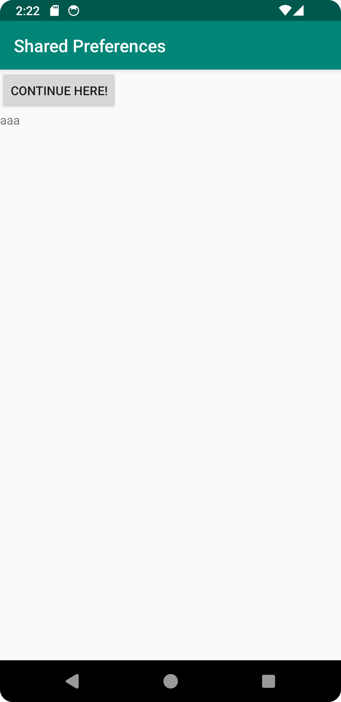
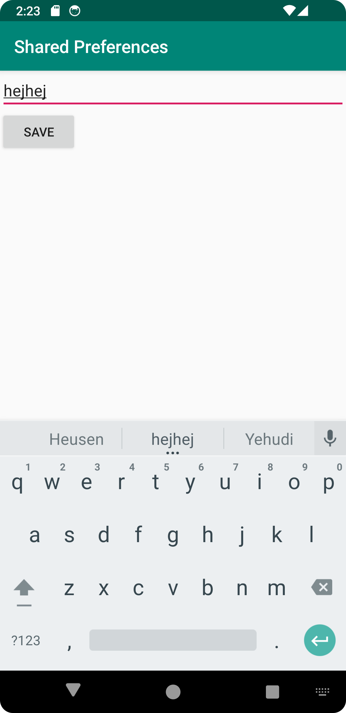

# Rapport

Jag började med att lägga till ett objekt i MainActivity, SharedPreferences.
Jag lade även till en TextView i OnCreate. Detta gjordes för att kunna läsa data från shared 
preferences. Se koden nedan.
```
        myPreferenceRef = getSharedPreferences( "MyAppPreferenceString" ,MODE_PRIVATE);

        prefTextRef=(TextView)findViewById(R.id.prefText);
        prefTextRef.setText(myPreferenceRef.getString("MyAppPreferenceString", "No preference found."));
```
Därefter skapade jag en ny activity, SecondActivity, samt tillhörande xml-fil, activity_second. Jag
tog bort onödig kod i SecondActivity. Se koden nedan.
```
public class SecondActivity extends AppCompatActivity {

    @Override
    protected void onCreate(Bundle savedInstanceState) {
        super.onCreate(savedInstanceState);
        setContentView(R.layout.activity_second);
    }
}
```
I activity_second lade jag till en EditText och Button. Button-texten "save" lades till 
som en string i strings.xml. Se koden nedan från activity_second.
```
    <EditText
        android:layout_width="match_parent"
        android:layout_height="wrap_content"
        android:id="@+id/settingseditview"
        tools:ignore="MissingConstraints" />
    <Button
        android:text="@string/save"
        android:layout_below="@+id/settingseditview"
        android:layout_width="wrap_content"
        android:layout_height="wrap_content"
        android:id="@+id/prefButton"
        android:onClick="savePref"
        app:layout_constraintTop_toBottomOf="@+id/settingseditview"
        app:layout_constraintStart_toStartOf="parent"/>
```
Jag skapade ett intent i MainActivity för att kunna öpnna SecondActivity. Jag skapade även en knapp
för att kunna öppna SecondActivity. Se koden nedan.
```
        goToSecondActivityButton = findViewById(R.id.openSecondActivityButton);
        goToSecondActivityButton.setOnClickListener(new View.OnClickListener() {
            @Override
            public void onClick(View view) {
                Intent intent = new Intent(MainActivity.this, SecondActivity.class);
                startActivity(intent);
            }
```
Jag behövde ändra i build.gradle för att detta skulle fungera. Se koden nedan.
```
implementation 'androidx.activity:activity:1.1.0'
```
I activity_main.xml lades en Button samt en TextView till för att kunna visa den sparade texten från
SecondActivity. Se koden nedan.
```
    <TextView
        android:layout_width="match_parent"
        android:layout_height="wrap_content"
        android:id="@+id/prefText"
        app:layout_constraintTop_toBottomOf="@+id/openSecondActivityButton" />

    <Button
        android:text="Continue here!"
        android:layout_width="wrap_content"
        android:layout_height="wrap_content"
        android:id="@+id/openSecondActivityButton"
        app:layout_constraintStart_toStartOf="parent"
        app:layout_constraintTop_toBottomOf="@+id/appBarLayout" />
```

I SecondActivity deklarerade jag två objekt, SharedPreferences.Editor samt SharedPreferences. 

I MainActivity lade jag till metoden onResume och flyttade över kod till metoden för att läsa data.
Se koden nedan.
```
    @Override
    protected void onResume() {
        super.onResume();
        // Display the new preference
        prefTextRef=(TextView)findViewById(R.id.prefText);
        prefTextRef.setText(myPreferenceRef.getString("MyAppPreferenceString", "No preference found."));
    }
```
I SecondActivity lade jag till en Button för att spara det som skrivits i EditText. I OnClick-metoden
kallade jag på savePref-metoden för att spara texten när man trycker på knappen. Se koden nedan.
```
        saveButton = findViewById(R.id.prefButton);
        saveButton.setOnClickListener(new View.OnClickListener() {
            @Override
            public void onClick(View view) {
                savePref(view);
                Intent intent = new Intent(SecondActivity.this, MainActivity.class);
                startActivity(intent);
            }
        });
```

Efter detta fungerade det att spara inskriven text när man växlade mellan MainActivity och SecondActivity.
Texten låg även kvar då appen startades om. Bifogat i projektet finns två skärmdumpar, en från MainActivity
och en från SecondActivity.




